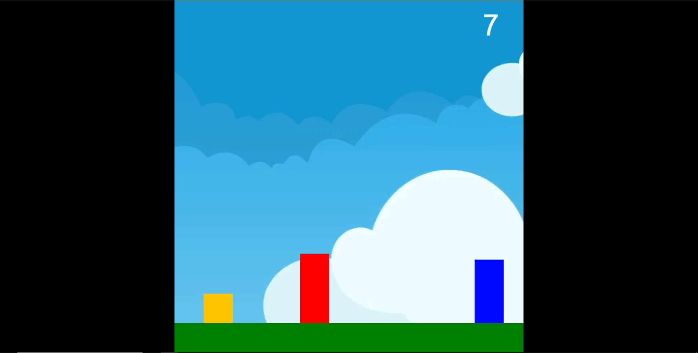

<h1 align="center">Square Game</h1>
<h1 align="center"></h1>

<h3 align="center">This is a simple game developed with JavaScript. That was a challenge for me, use phisical concepts during the application.</h3>

---

### 👨‍💻 Technologies

  <a href="https://en.wikipedia.org/wiki/HTML">HTML</a>&nbsp;&nbsp;&nbsp;|&nbsp;&nbsp;
  <a href="https://www.javascript.com/">JavaScript</a>

### 💻 About the project

  

#### 🔗 Play
https://yellow-square-game.vercel.app/Game.html

---

<h4 align="center"> <em>&lt;/&gt;</em> by <a href="https://github.com/PhOmena" target="_blank">PhOmena</a></h4>
